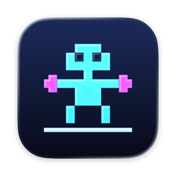

<p align="center">
  
</p>

<h1 align="center">DOS Boxer</h1>

<p align="center">
  Your DOS games, optimized for Apple Silicon.
</p>

<p align="center">
  <a href="https://github.com/cantcodewontcode/dos-boxer/releases/latest">Download</a> ·
  <a href="CHANGELOG.md">What's new</a> ·
  <a href="https://paypal.me/williamspry36">Buy me a coffee</a>
</p>

<!-- Screenshot: the library with a handful of games and the info panel open -->

## About DOS Boxer

DOS Boxer is a Mac app for playing DOS games. Drop in a game and it's ready to play. DOS Boxer maintains a portable library of all of your favorite games, and decorates them with coverart and rich metadata.

It's designed as a successor to [Boxer](https://github.com/alinebee/Boxer), the much-loved DOS app for the Mac that hasn't been updated in years. It's been rebuilt from the ground-up in Swift with Liquid Glass, designed for Apple Silicon. It uses the [DOSBox Staging](https://github.com/dosbox-staging/dosbox-staging) emulator.

## Features

- **Drag and drop to import.** Folders, ZIPs and CD images. DOS Boxer works out which program starts the game, including the "Press 1 for Sound Blaster" menus many collections use.
- **A proper library.** Box art, release year, developer, publisher, genres, ratings and descriptions. Sort and filter by any of them, make your own collections, and mark favorites.
- **It just plays.** Each game gets sensible settings for its era. The game window gets out of your way: pause, screenshots, full screen, and a choice of display looks.
- **Controllers.** Xbox, PlayStation and other controllers work out of the box, for up to two players. Remap buttons per game, including the ability to map joysticks to keypresses for games that don't natively support joysticks..
- **Roland MT-32 music.** Drop in your MT-32 ROMs once and every game that supports it sounds the way it was meant to.
- **Lives anywhere.** Keep your library in iCloud Drive, Dropbox or OneDrive and play on any of your Macs.
- **Opens your old Boxer games.** Existing `.boxer` gameboxes open as they are.

## Requirements

- A Mac with Apple Silicon
- macOS 26 or later

## Getting started

1. [Download the latest release](https://github.com/cantcodewontcode/dos-boxer/releases/latest), unzip it and drag DOS Boxer to your Applications folder.
2. Open it. It'll offer to download game details (release years, publishers, genres) from the LaunchBox Games Database.
3. Drag a game onto the window. Double-click it to play.

### Where do I get games?

DOS Boxer doesn't come with any. Plenty of DOS games are still sold, DRM-free, on [GOG](https://www.gog.com), and lots of shareware and freeware is free to download. Bring your own disks, folders, ZIPs and CD images and DOS Boxer will take it from there.

## Building from source

You'll need Xcode 26 and a few Homebrew packages:

```bash
brew install cmake ninja pkg-config autoconf automake libtool xcodegen
git clone --recursive https://github.com/cantcodewontcode/dos-boxer.git
cd dos-boxer
Scripts/bootstrap.sh
open DOSBoxer.xcodeproj
```

The first build compiles the emulator and everything it needs, so grab a coffee (20–30 minutes). After that, builds are quick.

<details>
<summary>How it's put together</summary>

| Path | What's there |
|---|---|
| `Sources/DOSBoxerApp` | The SwiftUI app: library, info panel, settings |
| `Sources/DOSBoxerKit` | Games, importing, the game window, Metal rendering, controllers |
| `Sources/DOSBoxerEngine` | A small helper that runs one game; each game runs in its own process |
| `Sources/DOSBoxerLab` | The compatibility lab: boots thousands of games unattended and reports which ones work |
| `Core/` | C++ layer that embeds DOSBox Staging, plus a few small patches |
| `Vendor/dosbox-staging` | DOSBox Staging, as a git submodule |

</details>

## Thanks

DOS Boxer stands on the shoulders of some great projects:

- [DOSBox Staging](https://github.com/dosbox-staging/dosbox-staging), the emulator that does the real work
- [Boxer](https://github.com/alinebee/Boxer) by Alun Bestor, the original and the inspiration
- [LaunchBox Games Database](https://gamesdb.launchbox-app.com), for game details
- [libretro-thumbnails](https://github.com/libretro-thumbnails/DOS), for box art
- [Sparkle](https://sparkle-project.org), for updates
- [Phosphor Icons](https://phosphoricons.com), for some of our in-app icons

## License

DOS Boxer is free software, licensed under the GNU General Public License, version 2 or later. See [LICENSE](LICENSE). Sparkle and Phosphor Icons are MIT-licensed; their notices are in [Licenses](Licenses) and inside the app.

Box art and game details are downloaded into your own library; none of it ships with the app.

If you're enjoying it, you can [buy me a coffee](https://paypal.me/williamspry36). ☕
